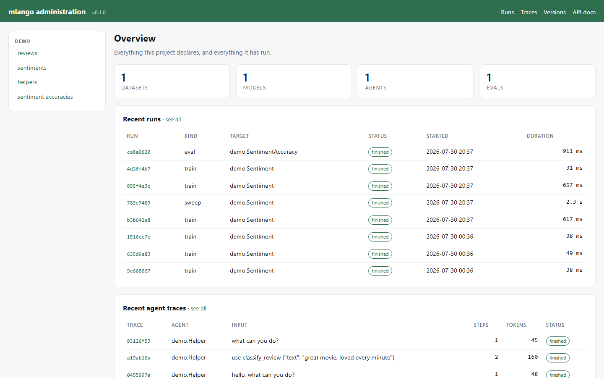
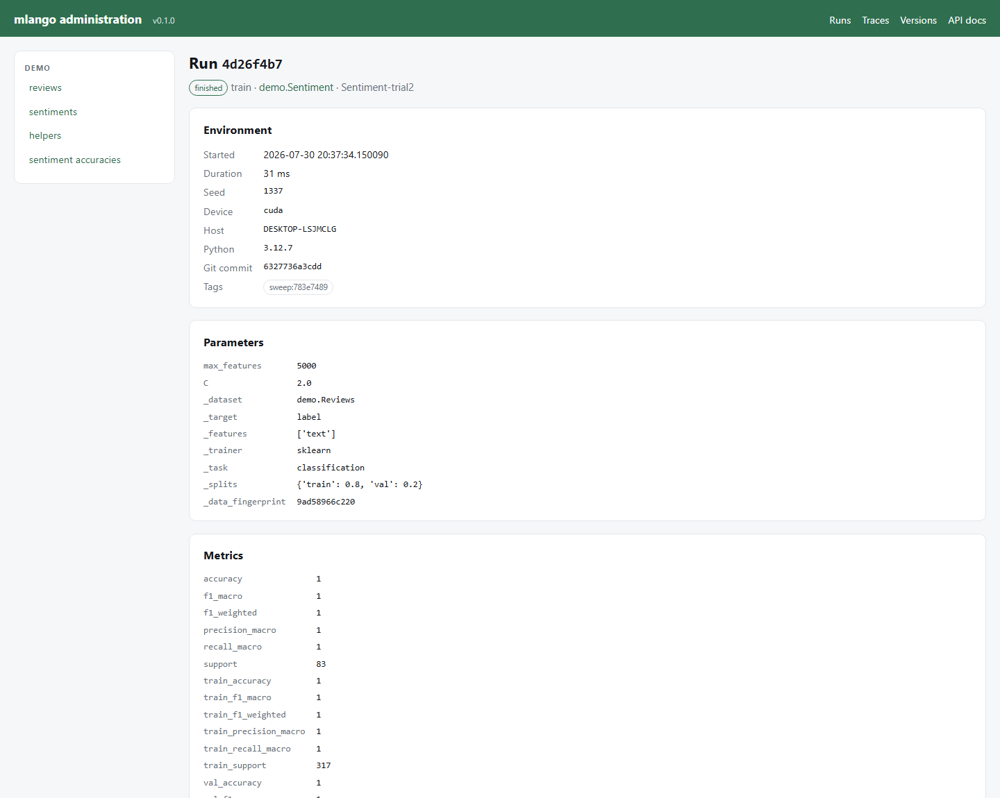
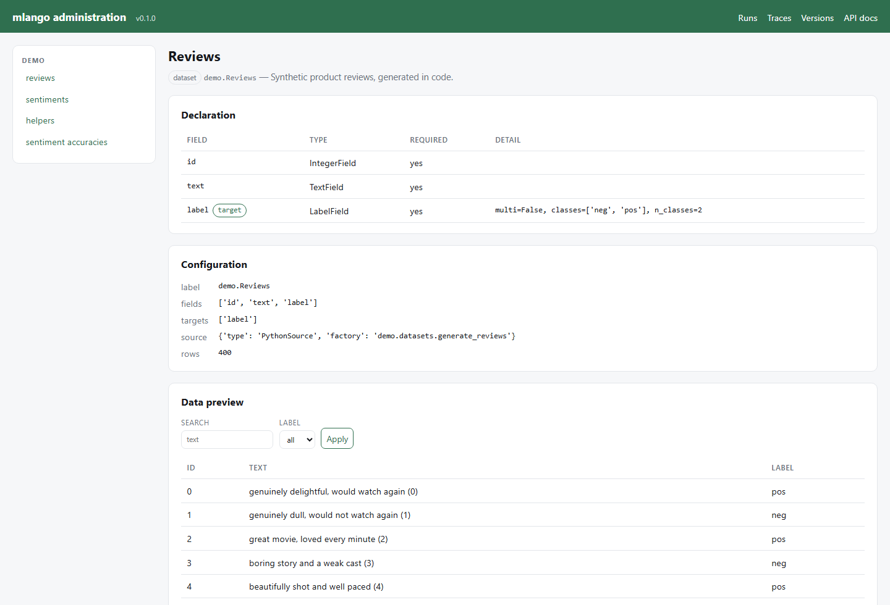
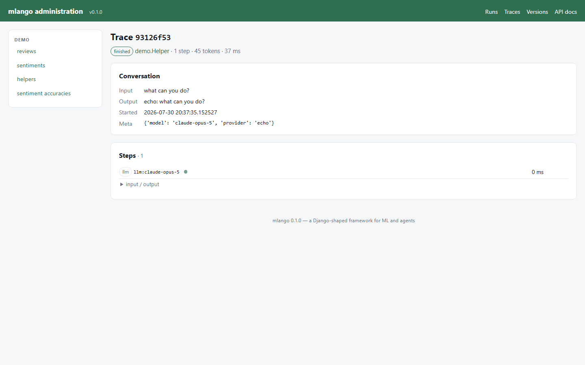
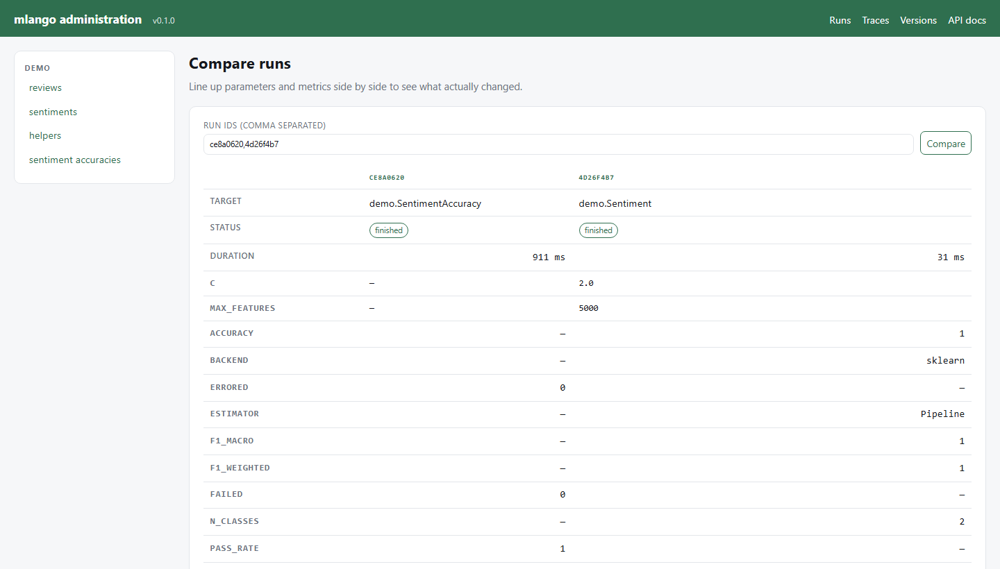

# Admin

The admin is generated from your declarations. There is no build step, no CDN and
no JavaScript framework: server-rendered Jinja2 with inline SVG charts, so it
works on a fresh `pip install` and offline.

```bash
python manage.py runserver
```

Then open <http://127.0.0.1:8000/admin/>.



Every screenshot on this page is the demo project a fresh `mlango startproject`
gives you, with nothing configured.

## What each page shows

=== "A run"
    Environment, parameters, metrics, artifacts and per-case evaluation results.
    The metric charts are inline SVG, so nothing is fetched to draw them.

    

=== "A dataset"
    A live preview of the declared source, with the filters and search derived
    from the field types, alongside the schema and materialised versions.

    

=== "An agent trace"
    Every step of a tool-use loop: what the model said, which tool it called,
    what came back, and how long each span took.

    

=== "Comparing runs"
    Two or more runs side by side, with the parameters and metrics that differ.

    

## Everything appears by default

Unlike Django, mlango registers nothing by hand. A project's first question is
always "what datasets and runs do I have?", and answering it should not require
writing an `admin.py` first.

Register only to change the presentation:

```python title="reviews/admin.py"
from mlango import admin

from reviews.datasets import Reviews


@admin.register(Reviews)
class ReviewsAdmin(admin.ObjectAdmin):
    list_display = ("id", "text", "label")
    list_filter = ("label",)
    search_fields = ("text",)
    list_per_page = 50
```

## `ObjectAdmin` options

| Option | Default | Effect |
|---|---|---|
| `list_display` | first six fields | Columns in the preview |
| `list_filter` | fields with a bounded set of values | Dropdown filters |
| `search_fields` | text fields | Case-insensitive substring search |
| `ordering` | source order | Default sort |
| `list_per_page` | 25 | Rows per page |
| `preview_limit` | 5000 | How many rows a filter may scan |
| `help_text` | `""` | Free text at the top of the page |

Naming a field that does not exist is caught by `manage.py check`, not at
render time.

## Custom columns

Add a `render_<column>` method:

```python
@admin.register(Reviews)
class ReviewsAdmin(admin.ObjectAdmin):
    list_display = ("id", "text", "label", "length")

    def render_length(self, record) -> str:
        return f"{len(record.text)} chars"
```

## What the pages show

**Overview** — counts per family, recent runs, recent traces, the latest model
and dataset versions.

**A declared object** — its full declaration (fields, types, whether required,
per-field detail), its resolved configuration, and then something specific to its
family:

| Family | Also shows |
|---|---|
| Dataset | A data preview with filters, search and pagination, plus materialised versions |
| Model | Registered versions with metrics and one-click promotion, plus its runs |
| Agent | Recent traces with steps, tokens and status |
| Eval | Recent runs with pass rates |

**Runs** — filterable by kind, status and target. A run page shows the full
reproducibility record (seed, device, host, Python version, git commit and
whether the tree was dirty, data fingerprint), every parameter, every metric,
inline charts for metrics with more than one point, artifacts with their SHA-256,
and — for evaluations — every case.

**Compare** — paste two or more run ids to line up parameters and metrics side by
side:

```
/admin/compare?ids=7c8f1020,c089b7e6
```

**Traces** — every agent call. A trace page shows the conversation and a timeline
of ordered spans, each expandable to its input, output, token usage and error.

**Versions** — every model and dataset version, with promotion controls.

## Authentication

The admin is **unauthenticated by default**, which is right for a laptop and
wrong for anything else.

```python
ADMIN_USERNAME = "admin"
ADMIN_PASSWORD = "…"        # enables HTTP Basic auth
```

`manage.py check` warns when the admin is open and `DEBUG` is off. For a real
deployment, put it behind your existing identity provider — an SSO proxy knows
about your organisation and this never will.

Disable it entirely with `ADMIN_ENABLED = False`, or serve the API alone:

```bash
python manage.py runserver --no-admin
```

## Theming

The admin follows the reader's light or dark preference automatically. To restyle
it, the whole appearance is one `<style>` block in
`mlango/admin/templates/base.html` — override the template by placing your own
earlier on the template search path, or contribute an improvement upstream.

## Several sites

```python
from mlango.admin import AdminSite

internal = AdminSite(name="internal")
internal.register(Reviews, ReviewsAdmin)
```

```python
from mlango.admin.app import build_admin_app

app.mount("/internal", build_admin_app(internal))
```

## The reason one admin covers four families

Every page is written against `_meta`, not against `Dataset` or `Model`. The
template asks the declaration what its fields are, what its targets are and what
kind of object it is — so a fifth family would not mean a fifth admin. See
[Concepts](concepts.md).
