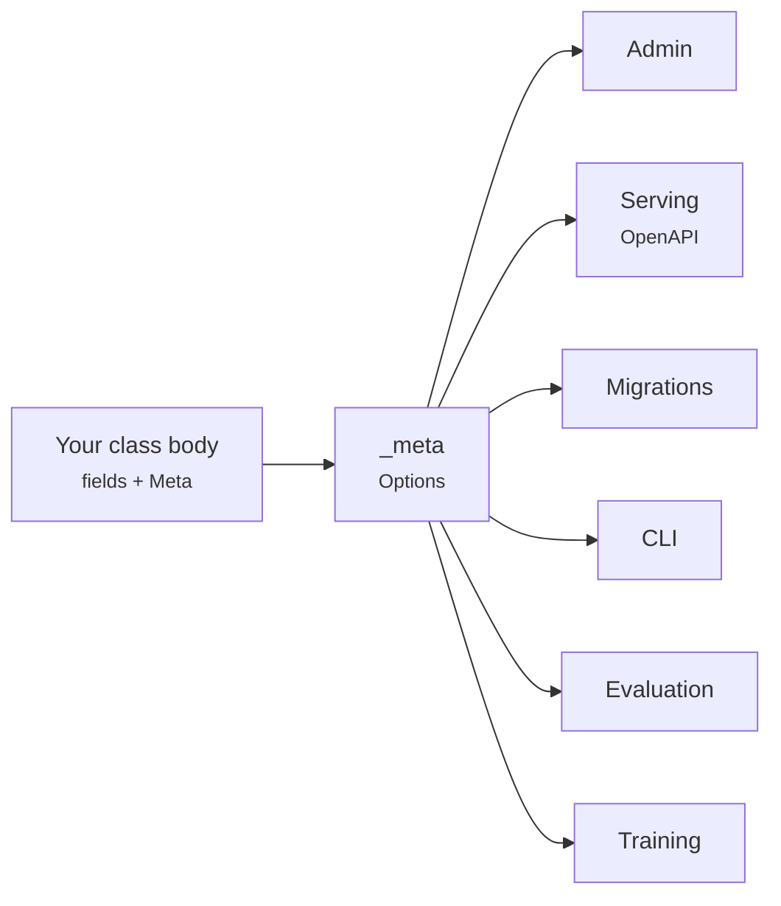

# Philosophy

Frameworks are opinions. These are the ones mlango holds, written down so you
can disagree with them before you have written any code, and so that decisions
elsewhere in the codebase stop looking arbitrary.

## The framework calls your code

A library is something you call. A framework is something that calls you. That
inversion is the whole difference, and it is what a pile of ML scripts is
missing.

```python
class Urgency(Model):
    C = fields.FloatField(default=1.0, tunable=True)

    class Meta:
        dataset = Tickets
        trainer = "sklearn"

    def build(self):
        return make_pipeline(TfidfVectorizer(), LogisticRegression(C=self.C))
```

You wrote `build()`. The framework opens a tracked run, seeds every generator,
splits the data deterministically, drives the loop, records metrics, captures
the git commit, writes the artifact and registers a version. None of that is in
your file, and none of it can be forgotten in the file where it matters.

The test of the principle: **when the framework needs something, it should look,
not ask.** Declaring a `Dataset` is enough for the admin to show it. There is no
registration step, no `admin.py` you must remember to write, no import that
makes the difference between working and not.

## One declaration, read by everything

There is exactly one place a fact about an object lives, and everything generic
reads it from there.



Nothing on the right knows about `Dataset`, `Model`, `Agent` or `Eval` as types.
They read `_meta`, which is why a single admin renders all four families and why
adding a fifth would not mean touching the admin at all.

The practical rule for contributors: **if a feature wants
`isinstance(obj, Dataset)`, find the `_meta` attribute it should read instead.**

## Explicit beats implicit, and silence is a bug

A typo should fail. It should not quietly do nothing.

```python
>>> settings.METASTOR
AttributeError: 'METASTOR' is not a known mlango setting. Settings must be
uppercase and declared in mlango.conf.global_settings.
```

`manage.py check` resolves every dotted path in `DEFAULT_CALLBACKS`,
`SERVE_MIDDLEWARE` and `STORAGE` before anything runs, because a typo in a
callback path would otherwise surface as the same import error repeated once per
sweep trial, half an hour in.

The same instinct shows up in smaller places. Metrics refuse to score a
prediction list and a truth list of different lengths, rather than zipping to the
shorter one and reporting a plausible number computed from the wrong rows.

## Errors are documentation

An error message is read at the worst possible moment by someone who does not
have the source open. It should say what went wrong **and what to do next**.

```python
raise FieldError(
    f"{opts.label} has no field named {name!r}. Available: {available}."
)
```

Listing the alternatives is not politeness; it is usually the whole answer. The
convention throughout: name the object, name what was wrong, name the way out.

## Reproducibility is a property of the system, not a discipline

Anyone can write down a seed. The point is that you cannot fail to.

Every run records the seed, the device, the git commit, the host, the Python
version and a fingerprint of the exact data view it read. Splits are assigned by
hashing each record's key, so adding rows next month never moves existing ones
between train and test, and a held-out set stays honest for as long as the
project lives.

Metric recording lives in the framework rather than in a callback. It used to be
a callback, and emptying `DEFAULT_CALLBACKS` silently destroyed all run history:
a configuration choice should not be able to delete your evidence.

## Local first, and offline by default

`mlango startproject` gives you something that runs: SQLite metastore, artifacts
in a directory, agents on an offline provider that needs no API key. No account,
no server, no credentials.

Everything that could need infrastructure is a settings change instead of a
rewrite: the metastore URL points at Postgres, `STORAGE["BACKEND"]` points at
your own class, `PROVIDERS` gains an entry. The default is the smallest thing
that works, and scaling up never means starting over.

## The demo is not empty

A fresh Django project shows you a rocket. A fresh mlango project shows you a
dataset, a trained model with real metrics, an agent with a tool, and an
evaluation suite, so the admin has something in it the first time you look.

This is a deliberate departure. The first five minutes decide whether someone
keeps going, and "I see how this works" beats "now what?".

## What mlango refuses to be

Naming these is part of the philosophy, because a framework that tries to fit
everything fits nothing.

- **Not an ORM.** A `Dataset` describes records that live in files, a warehouse
  or a hub. mlango wants to know their shape, not to own them.
- **Not a scheduler.** It is work that gets scheduled, not the thing scheduling.
- **Not a cluster.** It runs a training loop on the machine it is on.
- **Not a hosted service.** Nothing phones home; there is nothing to sign up to.

[What that means when choosing between tools](comparison.md) has the longer
version.

## For contributors

These follow from the above, and the review will hold you to them:

| Principle | In practice |
|---|---|
| Errors teach | Say what went wrong and what to do next, and list the alternatives |
| Comments explain why | The code says what it does; explain the constraint a reader cannot see |
| Tests are named after guarantees | `test_assignment_is_stable_when_rows_are_added`, not `test_split` |
| Layers stay separate | `core` imports nothing of ours; `data`, `training`, `agents` and `evals` do not import each other |
| No new required dependencies | Optional integrations go behind an extra with a lazy import |

[Architecture](architecture.md) shows how those layers actually fit together.
