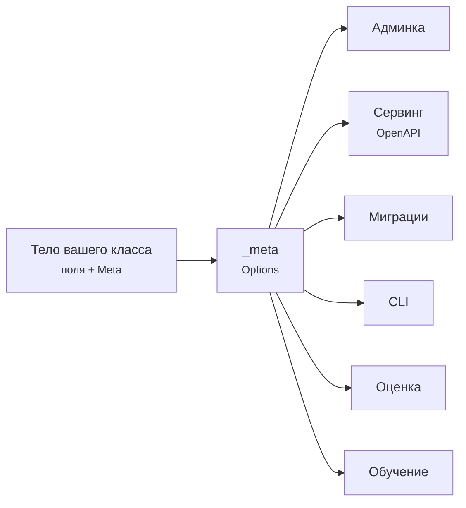

# Философия

Фреймворк — это набор мнений. Вот те, которых держится mlango: записаны, чтобы с
ними можно было не согласиться до того, как вы напишете первую строку, и чтобы
решения в остальном коде перестали выглядеть произвольными.

## Фреймворк вызывает ваш код

Библиотеку вы вызываете. Фреймворк вызывает вас. В этой инверсии всё различие, и
именно её не хватает груде ML-скриптов.

```python
class Urgency(Model):
    C = fields.FloatField(default=1.0, tunable=True)

    class Meta:
        dataset = Tickets
        trainer = "sklearn"

    def build(self):
        return make_pipeline(TfidfVectorizer(), LogisticRegression(C=self.C))
```

Вы написали `build()`. Фреймворк открыл отслеживаемый ран, поставил сид всем
генераторам, детерминированно разрезал данные, провёл цикл, записал метрики,
зафиксировал git-коммит, сохранил артефакт и зарегистрировал версию. Ничего из
этого нет в вашем файле — и ничего из этого нельзя забыть в том файле, где это
важно.

Проверка принципа: **когда фреймворку что-то нужно, он должен посмотреть, а не
спросить.** Объявить `Dataset` достаточно, чтобы админка его показала. Нет шага
регистрации, нет `admin.py`, который надо не забыть написать, нет импорта, от
которого зависит, работает оно или нет.

## Одна декларация, которую читают все

Факт об объекте живёт ровно в одном месте, и всё универсальное читает его
оттуда.



Ничто справа не знает о `Dataset`, `Model`, `Agent` или `Eval` как о типах. Они
читают `_meta` — поэтому одна админка отображает все четыре семейства, и поэтому
добавление пятого не означало бы правок в админке вообще.

Практическое правило для контрибьюторов: **если возможности хочется
`isinstance(obj, Dataset)`, найдите атрибут `_meta`, который она должна читать
вместо этого.**

## Явное лучше неявного, а молчание — это баг

Опечатка должна падать. Она не должна тихо ничего не делать.

```python
>>> settings.METASTOR
AttributeError: 'METASTOR' is not a known mlango setting. Settings must be
uppercase and declared in mlango.conf.global_settings.
```

`manage.py check` разрешает каждый путь в `DEFAULT_CALLBACKS`,
`SERVE_MIDDLEWARE` и `STORAGE` до того, как что-либо запустится, — иначе
опечатка в пути к колбэку всплыла бы одной и той же ошибкой импорта, повторённой
по разу на каждую попытку свипа, через полчаса после старта.

Тот же инстинкт в мелочах. Метрики отказываются считать пару списков разной
длины, вместо того чтобы сжать до короткого и выдать правдоподобное число,
посчитанное по не тем строкам.

## Ошибки — это документация

Сообщение об ошибке читают в худший возможный момент, и у читающего не открыт
исходник. Оно должно сказать, что пошло не так, **и что делать дальше**.

```python
raise FieldError(
    f"{opts.label} has no field named {name!r}. Available: {available}."
)
```

Перечислить альтернативы — это не вежливость, это обычно и есть весь ответ.
Соглашение по всему проекту: назвать объект, назвать, что не так, назвать выход.

## Воспроизводимость — свойство системы, а не дисциплины

Записать сид может кто угодно. Смысл в том, что не записать нельзя.

Каждый ран пишет сид, устройство, git-коммит, хост, версию Python и отпечаток
того представления данных, которое читал. Сплиты назначаются по хешу ключа
записи, поэтому добавление строк в следующем месяце не перемещает существующие
между train и test, и отложенная выборка остаётся честной столько, сколько живёт
проект.

Запись метрик живёт во фреймворке, а не в колбэке. Раньше это был колбэк, и
очистка `DEFAULT_CALLBACKS` молча уничтожала всю историю ранов: выбор
конфигурации не должен уметь удалять ваши свидетельства.

## Сначала локально, по умолчанию офлайн

`mlango startproject` даёт то, что запускается: метастор в SQLite, артефакты в
папке, агенты на офлайн-провайдере без API-ключа. Ни аккаунта, ни сервера, ни
учётных данных.

Всё, чему может понадобиться инфраструктура, — это смена настройки, а не
переписывание: URL метастора указывает на Postgres, `STORAGE["BACKEND"]` — на
ваш класс, в `PROVIDERS` добавляется запись. Умолчание — наименьшее, что
работает, и рост никогда не означает начать заново.

## Демо не пустое

Свежий проект Django показывает вам ракету. Свежий проект mlango показывает
датасет, обученную модель с настоящими метриками, агента с инструментом и набор
оценок — чтобы в админке с первого взгляда было что смотреть.

Это осознанное отступление. Первые пять минут решают, продолжит ли человек, и
«я понял, как это работает» лучше, чем «и что теперь?».

## Чем mlango отказывается быть

Назвать это — тоже часть философии, потому что фреймворк, который пытается
подойти всему, не подходит ничему.

- **Не ORM.** `Dataset` описывает записи, которые лежат в файлах, хранилище или
  на хабе. mlango хочет знать их форму, а не владеть ими.
- **Не планировщик.** Это работа, которую планируют, а не то, что планирует.
- **Не кластер.** Он ведёт цикл обучения на той машине, где запущен.
- **Не облачный сервис.** Никуда не звонит, регистрироваться негде.

[Что это значит при выборе между инструментами](comparison.md) — развёрнутая
версия.

## Для контрибьюторов

Всё это следует из сказанного выше, и на ревью с вас это спросят:

| Принцип | На практике |
|---|---|
| Ошибки учат | Скажите, что не так и что делать, и перечислите альтернативы |
| Комментарии объясняют «почему» | Код говорит, что он делает; объясните ограничение, которого не видно |
| Тесты названы по гарантии | `test_assignment_is_stable_when_rows_are_added`, а не `test_split` |
| Слои остаются раздельными | `core` не импортирует наше ничего; `data`, `training`, `agents` и `evals` не импортируют друг друга |
| Никаких новых обязательных зависимостей | Опциональные интеграции — за extra с ленивым импортом |

[Архитектура](architecture.md) показывает, как эти слои устроены на самом деле.
